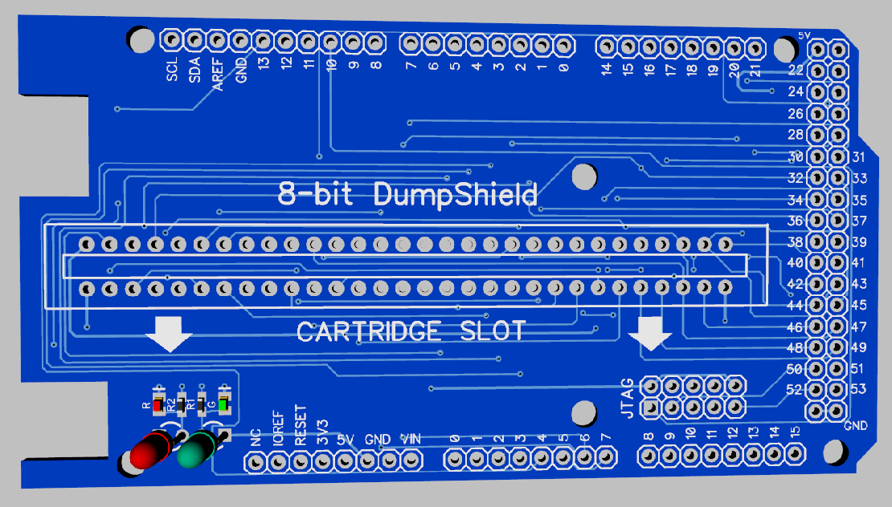
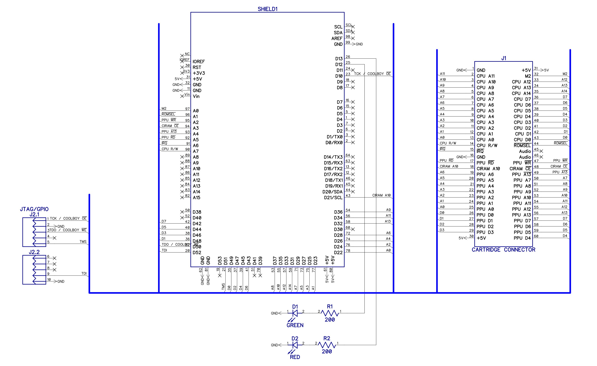

# 8-bit-DumpShield
Arduino MEGA2560 Shield for use with ClusterM famicom-dumper-client
- [https://github.com/ClusterM/famicom-dumper-client](https://github.com/ClusterM/famicom-dumper-client)

## Sketch

Sketch for MEGA2560 developed by **HardWareMan**. Based on firmware for Famicom Dumper/Programmer by **Cluster**
- [https://github.com/ClusterM/famicom-dumper](https://github.com/ClusterM/famicom-dumper)

## Overview

## Schematics and parts list

For building this Shield You need:
1. 60-pin edge socket
2. 96-pin headers
3. 2 resistors 0603 (200R)
4. 2 LEDs 0603, or 3mm.

That's all!

## Finished device with Arduino MEGA 2560

